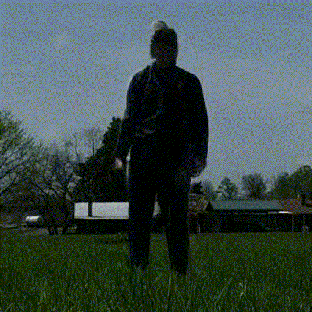
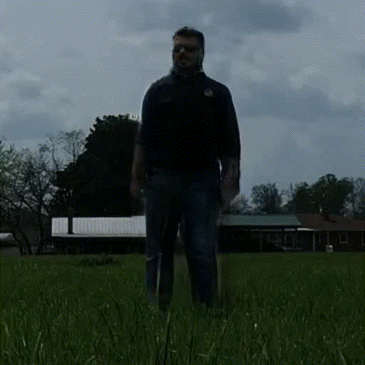
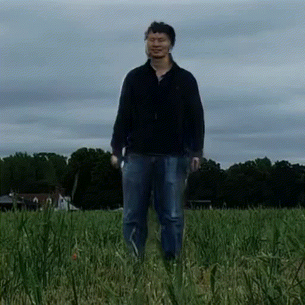
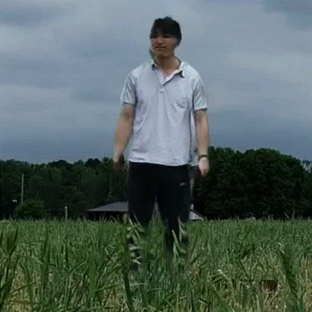
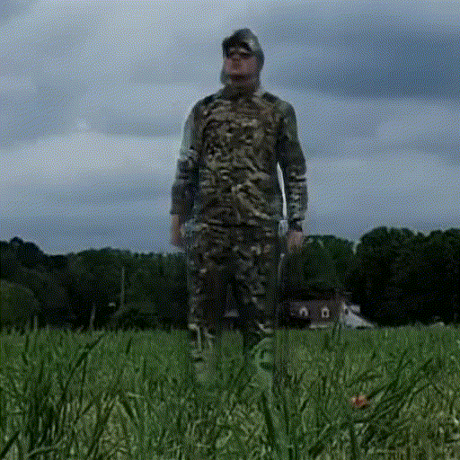
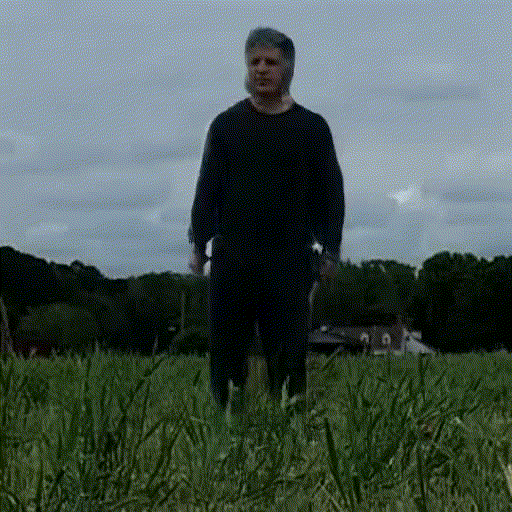

# <p align="center">Enhancing Human Action Recognition with GAN-based Data Augmentation (EHAR-GAN)</p>

<p align="center">
  <a href="https://doi.org/10.1117/12.3021572"></a>
  <a href="https://prasannapulakurthi.github.io/papers/PDFs/2024_SPIE_EHAR-GAN.pdf"></a>
  <a href="https://huggingface.co/datasets/prasannareddyp/Syn-RoCoG-v2"></a>
  <a href="LICENSE"></a>
</p>

Code for our **2024** paper "**Enhancing human action recognition with GAN-based data augmentation**,"
by [Prasanna Reddy Pulakurthi](https://www.prasannapulakurthi.com/), [Celso M. de Melo](https://celsodemelo.net/), [Raghuveer Rao](https://ieeexplore.ieee.org/author/37281258600), and [Majid Rabbani](https://www.rit.edu/directory/mxreee-majid-rabbani). [[PDF]](https://prasannapulakurthi.github.io/papers/PDFs/2024_SPIE_EHAR-GAN.pdf) [[Dataset]](https://huggingface.co/datasets/prasannareddyp/Syn-RoCoG-v2)

**Keywords:** Human Action Recognition (HAR), Generative Adversarial Network(GAN), Deep Neural Network (DNN), Synthetic Data, Data Augmentation.

## Overview
**EHAR-GAN** proposes a GAN-based framework for **enhancing human action recognition (HAR)** by generating synthetic gesture videos that vary both **motion** and **appearance**.  
By augmenting a small-sized real dataset with targeted motion transfer and style variation, we significantly improve HAR performance without requiring complex motion capture setups.

## Datasets

- RoCoG-v2 - [Original RoCoG-v2 Dataset](https://www.cis.jhu.edu/~rocog/data/)
- Syn-RoCoG-v2 - [Our Generated Synthetic Dataset](https://drive.google.com/file/d/1BQeKY65za_sth9QytFmjmsxny9C2z4-E/view?usp=sharing)

| Original Video | Motion Transfer to S01 | Motion Transfer to S02 | Motion Transfer to S03 | 
| :---: | :---: | :---: | :---: | 
| |  |  |  |
| Motion Transfer to S05 | Motion Transfer to S07 | Motion Transfer to S08 | Motion Transfer to S10 | 
| |  |  |  |

## Results
- [Experiment Results](https://drive.google.com/file/d/1hGq0SXFiYJmUaaEMXkE4rDiyMyUPU21_/view?usp=sharing)

## Citation
Please consider citing our paper in your publications if it helps your research. The following is a BibTeX reference.
```bibtex
@inproceedings{pulakurthi2024enhancing,
  title={Enhancing human action recognition with GAN-based data augmentation},
  author={Pulakurthi, Prasanna Reddy and De Melo, Celso M and Rao, Raghuveer and Rabbani, Majid},
  booktitle={Synthetic Data for Artificial Intelligence and Machine Learning: Tools, Techniques, and Applications II},
  volume={13035},
  pages={194--204},
  year={2024},
  organization={SPIE}
}
```
